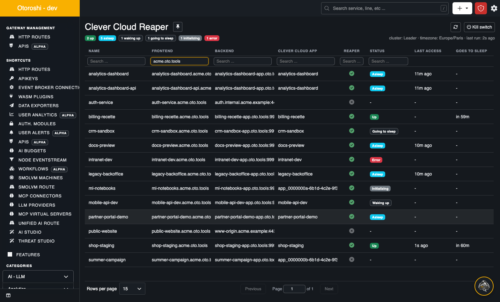

<p align="center">
  
</p>

# Cloud APIM - Clever Cloud Reaper for Otoroshi

An [Otoroshi](https://www.otoroshi.io/) extension that **puts the [Clever Cloud](https://www.clever.cloud)
apps nobody uses to sleep, and wakes them up on the next request**.

Staging, demo, preview and internal apps spend their nights and weekends waiting for someone, and a
Clever Cloud app costs money whether it serves a request or not. The reaper watches the traffic of
the Otoroshi routes in front of those apps. After a **grace period** without traffic it stops the
app's instances through the Clever Cloud API. The next request starts them again. While the app
boots, a browser gets a page that reloads itself once the app answers, and an API call is either
held until the app is up or refused at once with a `503` and a `Retry-After`.

📖 **[Full documentation](https://cloud-apim.github.io/otoroshi-clevercloud-reaper/)**, starting with
the [quickstart](https://cloud-apim.github.io/otoroshi-clevercloud-reaper/docs/quickstart).



## Otoroshi and Clever Cloud

Otoroshi has been deployed on [Clever Cloud](https://www.clever.cloud) since its very first day, and
Clever Cloud now runs it as a managed service,
[Otoroshi with LLM](https://www.clever.cloud/developers/doc/deploy/services/otoroshi/). A gateway that
already routes every request of Clever Cloud apps is the natural place to notice the ones nobody
uses, and to wake them up when someone does. The reaper uses the
[Clever Cloud API](https://www.clever.cloud/developers/api/) with an API token from
[clever-tools](https://github.com/CleverCloud/clever-tools), and counts savings with the
[Clever Cloud prices](https://www.clever.cloud/pricing/).

## Features

### Per route

- **One plugin, all the settings**: add `Cloud APIM - Clever Cloud Reaper` to a route and it is under
  the reaper. Grace period, must-be-up hours, monitoring filters, wake up mode and waiting page live
  in its config, and travel with the route
- **The app is found for you**: from the default `app-<uuid>.cleverapps.io` domain of the targets, or
  from the domains of your apps when you enable it from the console
- **Several routes, one app**: the routes of an app share its state, and the most demanding settings
  win

### Waking up

- **A waiting page for browsers**: it polls its own URL and reloads the moment the app really
  answers, not when a deployment says it is done. Bring your own HTML if you like
- **Held requests for APIs**: the request waits before the backend call, and goes through once the
  app is up, plus a ready delay. To the caller it is a slow response, not an error
- **Or a `503` at once**, with a `Retry-After`, for clients that retry on their own
- **Started once**: a burst of requests on a sleeping app asks for one start, cluster-wide

### Staying awake

- **Must-be-up ranges**: keep apps up during office hours, started before people arrive, with
  overnight ranges and timezones
- **Monitoring filters**: uptime checks and health probes neither keep an app awake nor wake it up,
  matched on path, URI, header, user agent or query param

### Operations

- **A console in the backoffice**: every route with the state of its app, and a page per route with
  its settings, its actions (wake up, put to sleep now, reset) and the history of its app
- **Hands off when in doubt**: an app whose last deployment failed is never stopped; an app that
  fails to stop or start goes into error and is left alone until someone resets it
- **Dry-run and a kill switch**: read what would be put to sleep before arming it, and stop all
  reaping across the cluster from the console, without a restart
- **Savings, in money**: each sleep is counted when it ends, at the cost of the app from its size and
  the Clever Cloud prices of its zone, and stored: per app and for the install, today, this month,
  this year and in all, with what the apps asleep right now would cost per hour
- **History, events and alerts**: every transition is kept per app and sent as an Otoroshi event; an
  app in error raises a `CleverCloudReaperAppInError` alert
- **Admin API**: list the apps, read their history, wake them up, put them to sleep, reset them

### Under the hood

- **Nothing on the request path**: an access is a map lookup and an atomic update, flushed in the
  background; the state is read from memory
- **Built for clusters**: one job per cluster drives the apps, with a lock per app in the datastore;
  workers serve from memory and report their traffic to the leaders
- **Nothing to deploy**: the state lives in the Otoroshi datastore, whatever its backend

## Requirements

- Otoroshi **18.0.0** or later
- Java **17** or later
- A Clever Cloud **API token**, created with clever-tools 3.12 or later

## Installation

1. Create a Clever Cloud API token, for a user that can stop and start the apps:

   ```bash
   clever tokens create "otoroshi reaper"
   ```

2. Download the jar from the
   [releases page](https://github.com/cloud-apim/otoroshi-clevercloud-reaper/releases/latest), named
   `otoroshi-clevercloud-reaper_3-<version>.jar`, with its `.sha256` checksum.

3. Start Otoroshi with the jar on its classpath and the token in its environment:

   ```bash
   CLEVER_CLOUD_API_TOKEN='...' java -cp "./otoroshi-clevercloud-reaper.jar:./otoroshi.jar" \
     play.core.server.ProdServerStart
   ```

   or mount it into the plugins directory of the Otoroshi Docker image (`OTOROSHI_PLUGINS_DIR_PATH`).
   The extension is enabled as soon as its jar is loaded. See the
   [install documentation](https://cloud-apim.github.io/otoroshi-clevercloud-reaper/docs/install).

## Getting started

1. Open **Clever Cloud Reaper** in the Otoroshi backoffice (search for it in the top bar).
2. Click the route in front of your app.
3. Check the app it guessed, set a grace period, and click **Enable the reaper**.

The app is put to sleep after its grace period without traffic, and woken up by the next request.
The [quickstart](https://cloud-apim.github.io/otoroshi-clevercloud-reaper/docs/quickstart) does it
with a two minute grace period, so you see it happen.

## Configuration

The settings of a route are in its plugin:

```json
{
  "app_id": "app_0f4c2b0e-1a2b-4c3d-8e9f-0123456789ab",
  "grace_period": 1800,
  "must_be_up_at": [{ "days": ["mon", "tue", "wed", "thu", "fri"], "start": "08:30", "end": "19:00" }],
  "timezone": "Europe/Paris",
  "allow_waiting_page": true,
  "api_behavior": "hold",
  "fail_timeout": 900,
  "ready_delay": 3,
  "monitoring_filters": [{ "source": "path", "regex": "^/health$" }]
}
```

The extension itself needs only the token. Everything else has a default:

| Env var | Default | |
|---|---|---|
| `CLEVER_CLOUD_API_TOKEN` | none | the API token. Without it the reaper does nothing |
| `CLEVER_CLOUD_API_URL` | `https://api-bridge.clever-cloud.com` | API tokens only work against the bridge |
| `CLOUD_APIM_EXTENSIONS_CLEVERCLOUD_REAPER_ENABLED` | `true` | |
| `CLOUD_APIM_EXTENSIONS_CLEVERCLOUD_REAPER_DRY_RUN` | `false` | evaluate and log, but never stop an app |
| `CLOUD_APIM_EXTENSIONS_CLEVERCLOUD_REAPER_TIMEZONE` | `Europe/Paris` | default timezone of the must-be-up ranges |
| `CLOUD_APIM_EXTENSIONS_CLEVERCLOUD_REAPER_JOB_INTERVAL` | `30000` | how often every app is evaluated (ms) |
| `CLOUD_APIM_EXTENSIONS_CLEVERCLOUD_REAPER_JOB_FAST_INTERVAL` | `5000` | how often apps in transit are followed (ms) |
| `CLOUD_APIM_EXTENSIONS_CLEVERCLOUD_REAPER_ACCESS_FLUSH_INTERVAL` | `10000` | how often each node flushes its accesses (ms) |
| `CLOUD_APIM_EXTENSIONS_CLEVERCLOUD_REAPER_HISTORY_SIZE` | `100` | transitions kept per app |
| `CLOUD_APIM_EXTENSIONS_CLEVERCLOUD_REAPER_SAVINGS_ENABLED` | `true` | count what sleeping saved |
| `CLOUD_APIM_EXTENSIONS_CLEVERCLOUD_REAPER_SAVINGS_CURRENCY` | `EUR` | the currency of the prices and the savings |

The [configuration reference](https://cloud-apim.github.io/otoroshi-clevercloud-reaper/docs/reference/configuration)
and the [plugin reference](https://cloud-apim.github.io/otoroshi-clevercloud-reaper/docs/reference/plugin)
have every key.

## Limits

- The reaper only stops **apps**: add-ons (databases, buckets...) keep running and are billed apart.
- A sleeping app runs nothing: no cron, no queue consumer. Give such apps a must-be-up range.
- It measures traffic through Otoroshi: an app that also gets traffic by another way can be put to
  sleep under it.
- Manage each app from one Otoroshi cluster: two clusters would not know about each other's traffic.

## Development

```bash
sbt test          # unit tests, and end-to-end tests against an in-process otoroshi and a fake clever cloud
sbt assembly      # target/scala-3.8.4/otoroshi-clevercloud-reaper-assembly_3-dev.jar
./rebuild.sh      # assembly, linked into a local otoroshi checkout (../otoroshi/otoroshi/lib), reloaded
```

The documentation is a [Docusaurus](https://docusaurus.io/) site in [`documentation/`](documentation),
published to GitHub Pages by CI. Its screenshots are taken by a Playwright script against a fake
Clever Cloud: see [`documentation/screenshots`](documentation/screenshots).

Releases are made by hand: **Actions → release → Run workflow**, with the version. The workflow tests,
builds the jar, tags the commit and publishes the release with the jar and its checksum.

## License

Apache 2.0
