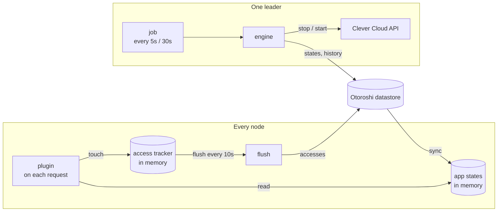

# Architecture

The reaper is built so that **the request path never waits on anything**: no datastore read, no
call to Clever Cloud, no lock. Everything a request needs is in memory; everything slow happens in
the background, on one node.

## The pieces

### The plugin

On each request of a route under the reaper, the plugin:

1. reads the state of the app **from memory**;
2. if the app is up: records the access (a map lookup and an atomic `max`) and lets the request
   through;
3. if the app sleeps: records the access, asks for a wake up, and answers the caller (see
   [Waking up](./waking-up)).

### The access tracker and its flush

Accesses are kept in memory per app, as the latest timestamp seen. Every **10 seconds**
(`access-flush-interval`), each node flushes what it saw:

- a **leader** writes it to the datastore, keeping the latest of what is stored and what it saw;
- a **worker** sends it to a leader, which does the same.

A flush that fails is put back and sent with the next one. The cost of a request is therefore
independent of the traffic: ten thousand requests on an app between two flushes are one write.

The flush interval adds to the reaction time of the reaper: an app with a grace period of one hour
is judged on accesses at most 10 seconds old, which does not matter at that scale.

### The job

The job `Cloud APIM - Clever Cloud Reaper` runs **once per cluster**: Otoroshi elects one leader to
run it, with a lock in the datastore. It runs every 5 seconds (`job.fast-interval`), and evaluates:

- **all** the apps every 30 seconds (`job.interval`);
- in between, only the apps in transit and the ones a request just asked for.

For each run, it lists the apps under the reaper from the routes in memory, reads their Clever Cloud
state in **one** call (`GET /v2/summary`), and for each app that needs it reads its last deployment.
Then, app by app, under a lock:

1. it reads the stored state of the app;
2. it decides what to do with the [rules of the lifecycle](./lifecycle);
3. it stops or starts the app on Clever Cloud;
4. it stores the new state, appends the transition to the history, and sends an event.

### The engine and its locks

The job is not the only one that acts on apps: a wake up asked by a request, and the actions of the
console, do too. They all go through the same engine, and the engine takes a **lock per app** in the
datastore (60 seconds, released as soon as it is done). Two leaders, or the job and a wake up, never
work on the same app at the same time, so an app is never started twice.

### Syncing the memory

At each state sync, every node reloads from the datastore the states of the apps, the last accesses
and the settings (the kill switch). That is what the plugin reads. On a leader the engine also
updates the memory directly, so a change is visible there at once.

## In an Otoroshi cluster

In a [leader/worker cluster](https://maif.github.io/otoroshi/manual/docs/deploy/clustering), workers
never reach the datastore and never call Clever Cloud. The reaper follows the same split.

| | Leaders | Workers |
|---|---|---|
| Serve requests | yes | yes |
| Record accesses | to the datastore | sent to a leader every 10s |
| Ask for a wake up | handle it | forward it to a leader |
| Follow a held request | from memory | ask a leader every 2s |
| Run the job, call Clever Cloud | yes, one at a time | never |
| Know the states | memory, refreshed from the datastore | memory, refreshed at each cluster sync |

Workers talk to the leaders with the cluster credentials they already have
(`otoroshi.cluster.leader.*`), on the admin API of the leaders, under
`/api/extensions/cloud-apim/extensions/clevercloud-reaper`. There is nothing more to open or
configure.

When a worker loses its leaders:

- requests on apps that are up keep going through: the worker serves from memory;
- accesses pile up in memory, and are sent once the leaders are back;
- requests on sleeping apps cannot wake them up: held requests wait until their fail timeout, the
  waiting page keeps polling.

## What is stored

Everything lives in the Otoroshi datastore, under
`<storageRoot>:extensions:cloud-apim_extensions_clevercloudreaper` (`storageRoot` is `otoroshi` by
default):

| Key | Type | |
|---|---|---|
| `...:states:<app_id>` | string (JSON) | the state of the app |
| `...:access:<app_id>` | string | the last access to the app, in epoch milliseconds |
| `...:history:<app_id>` | list | its transitions, latest first, capped to `history-size` |
| `...:wakes:<app_id>` | string, expires after 30 min | a wake up asked and not done yet |
| `...:locks:<app_id>` | string, expires after 60 s | the lock of the engine on the app |
| `...:settings` | string (JSON) | the kill switch, who set it and when |

The settings of the routes are not here: they are in the routes themselves, in the config of their
plugin, and follow the routes in exports, imports and backups.

## The Clever Cloud API

The reaper uses a handful of endpoints of the Clever Cloud API v2, through the API bridge:

| Call | When |
|---|---|
| `GET /v2/summary` | every run of the job: the state of every app the token can see, in one call |
| `GET /v2/organisations/{owner}/applications/{app}/deployments?limit=1` | before a stop, and while an app starts |
| `DELETE /v2/organisations/{owner}/applications/{app}/instances` | to put an app to sleep |
| `POST /v2/organisations/{owner}/applications/{app}/instances` | to wake it up |
| `GET /v2/organisations/{owner}/applications` | for the app lists of the console, cached a minute |

Apps owned by a user rather than an organisation are under `/v2/self` instead of
`/v2/organisations/{owner}`.

The calls go through the Clever Cloud proxy of the Otoroshi global config (`proxies.clevercloud`),
if one is set. A rate-limited or failing call is logged and
retried at the next run.
