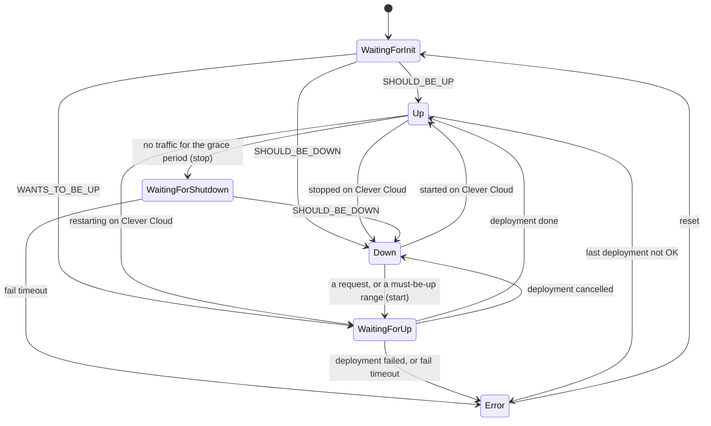

# The lifecycle

The reaper keeps **one state per Clever Cloud app**. The state is not the Clever Cloud state: an app
the reaper just asked to stop is still `SHOULD_BE_UP` on Clever Cloud for a while, and an app that
is starting is `SHOULD_BE_DOWN` until its deployment begins. The reaper's state says where the app
stands **from the reaper's point of view**, and what it is waiting for.

## The states

| State | Console | |
|---|---|---|
| `WaitingForInit` | Initializing | just put under the reaper, or reset: its state is read from Clever Cloud at the next run |
| `Up` | Up | running. Put to sleep after its grace period without traffic |
| `WaitingForShutdown` | Going to sleep | the reaper asked Clever Cloud to stop it |
| `Down` | Asleep | stopped. Started by the next request, or at the start of a must-be-up range |
| `WaitingForUp` | Waking up | the reaper asked Clever Cloud to start it, or it is starting |
| `Error` | Error | something went wrong: the reaper leaves the app alone until someone resets it |

## The transitions

### Going to sleep

An `Up` app is put to sleep when **all** of these hold:

- Clever Cloud says it is `SHOULD_BE_UP`;
- it is outside all the must-be-up ranges of its routes;
- it has had no traffic for its grace period, counted from its last request or from when it came
  up, whichever is later;
- the kill switch is off, and the extension does not run in dry-run.

Before stopping it, the reaper reads the **last deployment** of the app: a stop is only safe when
the app can come back.

| Last deployment | Then |
|---|---|
| `OK`, or none | the instances are stopped: `WaitingForShutdown` |
| `WIP`, `TASK_RUNNING` | someone is deploying: the reaper waits and checks again at the next run |
| `FAIL`, `CANCELLED` | `Error`: the last deployment did not succeed, a stopped app might not start again |

Then `WaitingForShutdown` becomes `Down` when Clever Cloud says `SHOULD_BE_DOWN`, or `Error` if it is
still up after the fail timeout.

### Waking up

A `Down` app is started when a request asks for it, or when one of its must-be-up ranges begins. A
start triggers a deployment on Clever Cloud, which the reaper follows:

| Clever Cloud state | Deployment | Then |
|---|---|---|
| `SHOULD_BE_UP` | `WIP`, `TASK_RUNNING` | wait |
| `SHOULD_BE_UP` | `OK` (or none, when someone else started it) | `Up` |
| any | `FAIL` | `Error` |
| `WANTS_TO_BE_UP`, `SHOULD_BE_DOWN` | `CANCELLED` | `Down`: the next request asks again |
| `SHOULD_BE_DOWN` | none after one minute | started again, same fail timeout |

If the app is not up within the **fail timeout** (15 minutes by default) of its start, it goes to
`Error`. A restart after one minute keeps the clock of the first start: an app whose starts keep
vanishing still ends in error.

An app that was **never deployed** cannot be started: the start fails with Clever Cloud error
`4014` and the app goes to `Error` at once.

### Changes made outside the reaper

The reaper follows what happens on Clever Cloud, whoever does it:

- an `Up` app **stopped** from the Clever Cloud console or clever-tools becomes `Down`. It is
  started again by the next request, like any sleeping app;
- a `Down` app **started** outside the reaper becomes `Up` (or `WaitingForUp` while it boots);
- an `Up` app **redeployed** (a `git push`, a restart) goes through `WaitingForUp` and back to `Up`.

### Errors

An app in `Error` is **left alone**: never stopped, never started. Requests go through to it as if
the reaper was not there, which is the safest guess, since the app may well be running. An alert is
raised when an app enters this state (see [Operations](./operations#alerts)), and the cause is shown
in the console.

The causes:

| Cause | |
|---|---|
| `the app did not stop within the fail timeout` | the stop never completed |
| `the app did not start within the fail timeout` | the start never completed |
| `the app failed to start on clever cloud` | its deployment failed |
| `the last deployment of the app is '...', it cannot be put to sleep safely` | a failed or cancelled last deployment |
| `the app was never deployed, it cannot be started` | Clever Cloud error `4014` |
| `unexpected clever cloud state '...'` | the app is `MODERATED`, in `DEFAULT_OF_PAYMENT`, or in a state the reaper does not know |

Once the problem is fixed, **Reset** the app from the console (or `POST .../_reset` on the
[admin API](./reference/admin-api)): it goes back to `WaitingForInit`, and its state is read again
from Clever Cloud.

## Releasing an app

When no route manages an app anymore (the plugin was removed or switched off, the route deleted, the
app id changed), the reaper **releases** it:

- if the app sleeps, it is **started**, so nobody is left with an app that nothing will ever wake up;
- then its state is **forgotten**. Its history stays in the datastore.

From the console, **Disable the reaper** releases the app at once. A change made elsewhere (the route
designer, the admin API, a deleted route) is noticed by the job, which waits **five minutes** before
releasing the app, so a route being edited does not start an app back for nothing.

## When the reaper runs

The [job](./architecture#the-job) evaluates the apps on two paces:

- **every 30 seconds** (`job.interval`), all the apps: that is when idle apps are put to sleep and
  must-be-up ranges start apps;
- **every 5 seconds** (`job.fast-interval`), only the apps in transit (`WaitingForInit`,
  `WaitingForShutdown`, `WaitingForUp`) and the ones a request just asked for: so an app that
  finished starting is seen up within five seconds.

A wake up does not wait for the job: the leader that receives it starts the app at once.

An app with a grace period of one hour is therefore put to sleep between 60:00 and 60:30 after its
last request.
