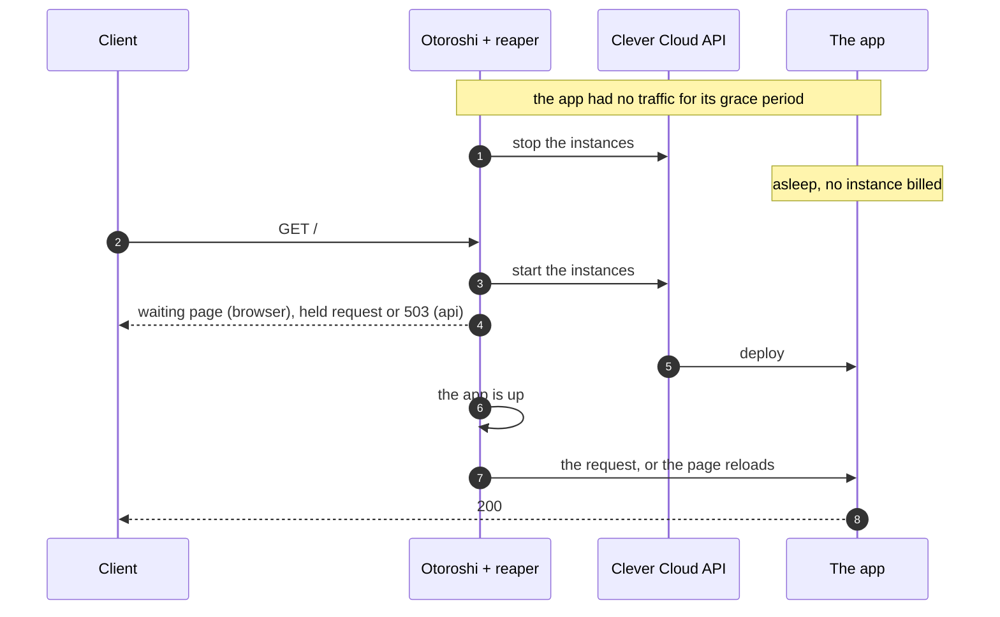
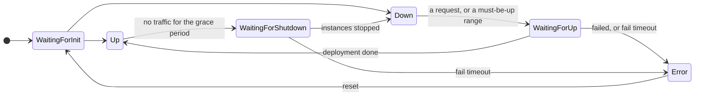

# Overview

The Clever Cloud Reaper is an [Otoroshi](https://www.otoroshi.io/) admin extension that **puts the
[Clever Cloud](https://www.clever.cloud) apps nobody uses to sleep, and wakes them up on the next
request**.

Staging, demo, preview and internal apps spend most of their life waiting for someone. On Clever
Cloud an app that runs costs money whether it serves a request or not. The reaper watches the
traffic Otoroshi already routes to those apps. When an app has had no traffic for its **grace
period**, the reaper stops its instances. The next request starts them again, and while the app
boots the caller either waits, gets a page that reloads by itself, or gets a clean `503`.

## Why in the gateway

A reaper needs two things: to know when an app was last used, and to stand in front of it when it
sleeps. The gateway already does both.

- **Traffic is measured where it flows.** Every request through a route counts as an access, at the
  cost of a map lookup and an atomic update. There is no analytics backend to query and no log
  pipeline to keep running.
- **No traffic switching.** The reaper is a plugin of the route. Nothing has to point the domain at
  a waiting page and back again, so nothing can get stuck pointing at the wrong place.
- **Waking up is just a request.** The request that finds the app asleep is the one that wakes it
  up, and it can be held until the app answers. To the caller it looks like a slow response.

## What you get

- **A plugin per route.** All the settings of a route live in the plugin: grace period, the time
  ranges where the app must stay up, the monitoring requests to ignore, what callers get while the
  app wakes up, and a custom waiting page.
- **Three ways to wait.** Browsers get a waiting page that reloads itself once the app really
  answers. API calls are either held until the app is up or refused at once with a `503` and a
  `Retry-After`. See [Waking up](./waking-up).
- **A console in the Otoroshi backoffice.** Every route, the reaper state of each, and a page per
  route with its settings, its actions (wake up, put to sleep now, reset) and its history. See
  [The console](./console).
- **A cluster-aware engine.** One job per cluster drives the apps through their lifecycle, with a
  datastore lock per app. Workers report their traffic to the leaders and serve from memory. See
  [Architecture](./architecture).
- **Savings, in money.** What each sleep saved, from the size of the app and the Clever Cloud prices
  of its zone: per app and for the install, today, this month, this year and in all. See
  [Savings](./savings).
- **History, events and alerts.** Every transition is kept per app, sent as an Otoroshi analytics
  event, and an app that falls into error raises an alert. See [Operations](./operations).
- **Safety switches.** A dry-run mode, a kill switch shared by the whole cluster, and an error state
  where the reaper keeps its hands off the app until someone looks at it.

## The pieces

| Piece | Runs on | Does |
|---|---|---|
| The **plugin** `Cloud APIM - Clever Cloud Reaper` | every node, on every request of a route | records the last access in memory, and when the app sleeps asks for a wake up and answers the caller |
| The **job** `Cloud APIM - Clever Cloud Reaper` | one leader of the cluster at a time | reads the state of the apps from the Clever Cloud API, decides, stops and starts them |
| The **extension** | every node | holds the state in memory, flushes the accesses, serves the console and the admin API |
| The **datastore** | Otoroshi's own | the state, last access and history of each app, shared by the cluster |

There is nothing else to deploy: no database, no sidecar, no separate service. The reaper uses the
Otoroshi datastore and talks to the Clever Cloud API with an [API token](./install#create-a-clever-cloud-api-token).

## The lifecycle in one picture

Every state, transition and edge case is described in [The lifecycle](./lifecycle).

## Where to go next

- **Try it in five minutes:** [Quickstart](./quickstart).
- **Install it for real:** [Install](./install).
- **Tune a route:** [Configuring a route](./route).
- **Understand what a caller sees:** [Waking up](./waking-up).
