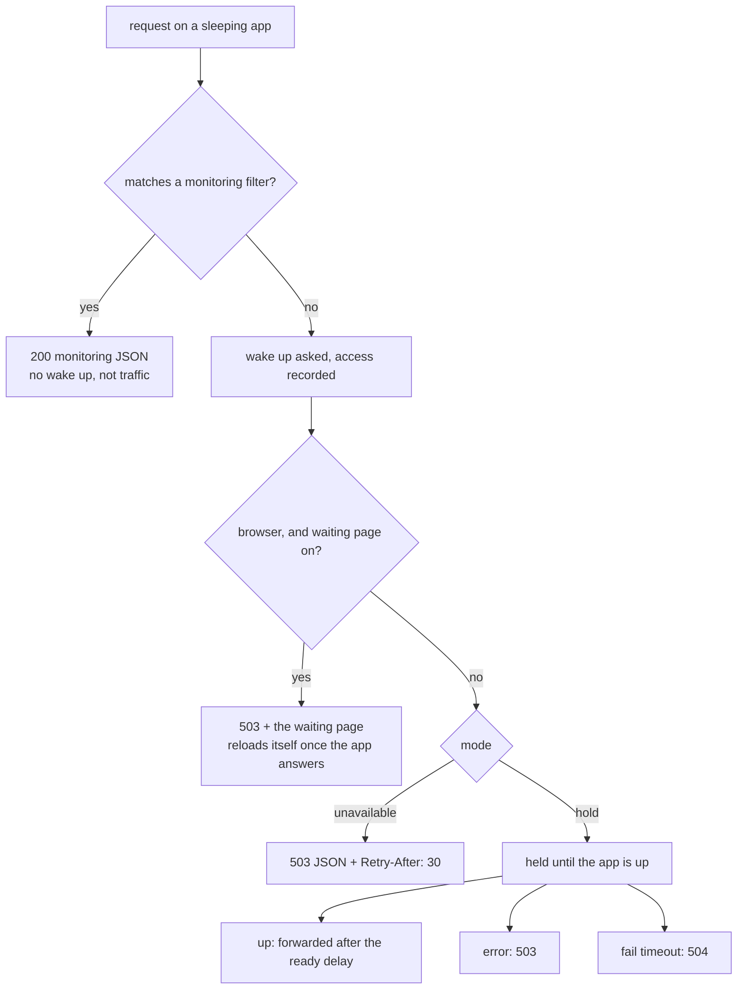
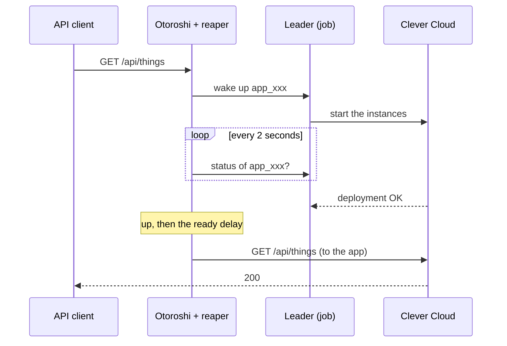

# Waking up

A request that reaches a route whose app sleeps does two things: it **asks for a wake up**, and it
gets **an answer while the app boots**. Booting a Clever Cloud app takes from about thirty seconds to
a few minutes, depending on the runtime and the build, so that answer matters.

## When does a request find the app asleep?

When the app is in one of these states:

| State | Meaning |
|---|---|
| <span className="status status--going">Going to sleep</span> `WaitingForShutdown` | the reaper asked Clever Cloud to stop it, the instances are going down |
| <span className="status status--asleep">Asleep</span> `Down` | stopped |
| <span className="status status--waking">Waking up</span> `WaitingForUp` | starting on Clever Cloud |

In every other state the request goes through to the app as usual. That includes
<span className="status status--error">Error</span>: in error the reaper keeps its hands off the
app, which may very well be running.

## The answer



A **browser** is a `GET` or `HEAD` request whose `Accept` header contains `text/html`: what a browser
sends when someone opens a page. Everything else (`fetch` and XHR calls, API clients, `POST`s from a
form) gets the **mode** of the route.

### The waiting page, for browsers

With **Waiting page for browsers** on (the default), a browser gets a `503` with an HTML page that
says the app is waking up, and **reloads itself once the app answers**:


The page does not trust a status to reload. Every five seconds it sends a `HEAD` request to its own
URL, marked as a poll (see [the headers](./reference/headers)):

- while the app sleeps, the reaper answers the poll itself, and says so;
- once the app is up, the poll goes through to the app. Any answer of the app (a `200`, a redirect to
  a login page, its own `404`) means it is there, and the page reloads. A `5xx`, or the `404` Clever
  Cloud answers for an app with no instance, means it is not there yet.

So the user lands on the app the moment it really answers that URL, not when Clever Cloud says the
deployment is done. If the app goes into error, the page says so and polls every thirty seconds.

The page is answered with a `503` and `Retry-After: 30` on purpose: a crawler or an uptime check
that gets it does not take it for the content of the site.

You can replace the page with your own: see [The waiting page](./waiting-page).

### `hold`: the request waits

In `hold` mode (the default), the request **waits, held open, until the app is up**, then goes
through as if nothing happened, just slowly. For the caller it is a long response time.



- It ends when the app is **up**, plus the **ready delay** (3 seconds by default): Clever Cloud
  reports an app up when its deployment ends, and some apps need a moment more before their first
  request.
- If the app goes into **error**, the request gets a `503` "the application could not be started".
- If the app is not up within the **fail timeout** of the route, the request gets a `504` "the
  application did not wake up in time".

The plugin runs in the access validation step, before Otoroshi calls the backend: the backend
timeouts of the route do not apply to the wait. However many requests wait for an app, a node
follows it with **one** poll loop.

:::caution Timeouts in front of Otoroshi
Anything between the caller and Otoroshi can give up before the app is up: the HTTP client's own
timeout, a load balancer, a CDN. Check their timeouts against the boot time of your app, or use the
`unavailable` mode for callers that cannot wait that long.
:::

### `unavailable`: a 503 at once

In `unavailable` mode the request gets, at once:

```http
HTTP/1.1 503 Service Unavailable
Retry-After: 30
CleverCloud-Reaper-Status: Down
Content-Type: application/json

{"error":"the application is waking up, retry later","status":"Down"}
```

The wake up is asked all the same. That is the right mode for clients that retry on their own (most
SDKs retry a `503` with a `Retry-After`), for webhooks whose sender retries, and for anything where a
request held for a minute does more harm than a refusal.

### Turning the waiting page off

With **Waiting page for browsers** off, browsers get the mode of the route like everything else:
held in `hold` mode, which shows as a page that takes a minute to load, or a JSON `503` in
`unavailable` mode. Turn it off for routes that only serve an API.

## The wake up itself

- **Asked once.** A burst of requests on a sleeping app asks for one wake up, on each node, then
  again every ten seconds while requests keep waiting, in case an ask got lost.
- **From any node.** A worker forwards the ask to a leader. A leader handles it at once, without
  waiting for the next run of the job.
- **Kept until it succeeds.** The ask is stored for thirty minutes: if the start fails, or the app is
  locked by another operation, the next run of the job tries again, until the fail timeout.
- **Started only once.** A lock per app in the datastore makes sure two leaders, or a wake up and the
  job, never start the same app twice.
- **While it goes to sleep.** A request on an app that is still going to sleep waits for the stop to
  finish, then starts it again: stopping and starting at the same time would leave the app in an
  unknown state.

A request that finds the app asleep **counts as traffic**: once the app is up, it gets a full grace
period before it can be put to sleep again.

## Monitoring requests

A request that matches one of the [monitoring filters](./staying-awake#monitoring-filters) of the
route, while the app sleeps, gets a `200` without waking it up:

```json
{"monitoring": true, "status": "Down"}
```

So your uptime checks keep reporting the route as fine while the app sleeps, which is what it is
supposed to do. While the app is up, monitoring requests go through to it as usual, but do not count
as traffic.
